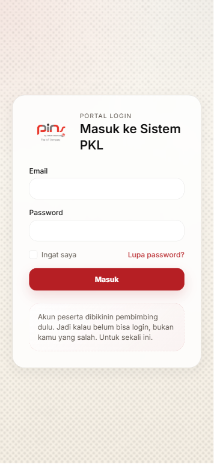
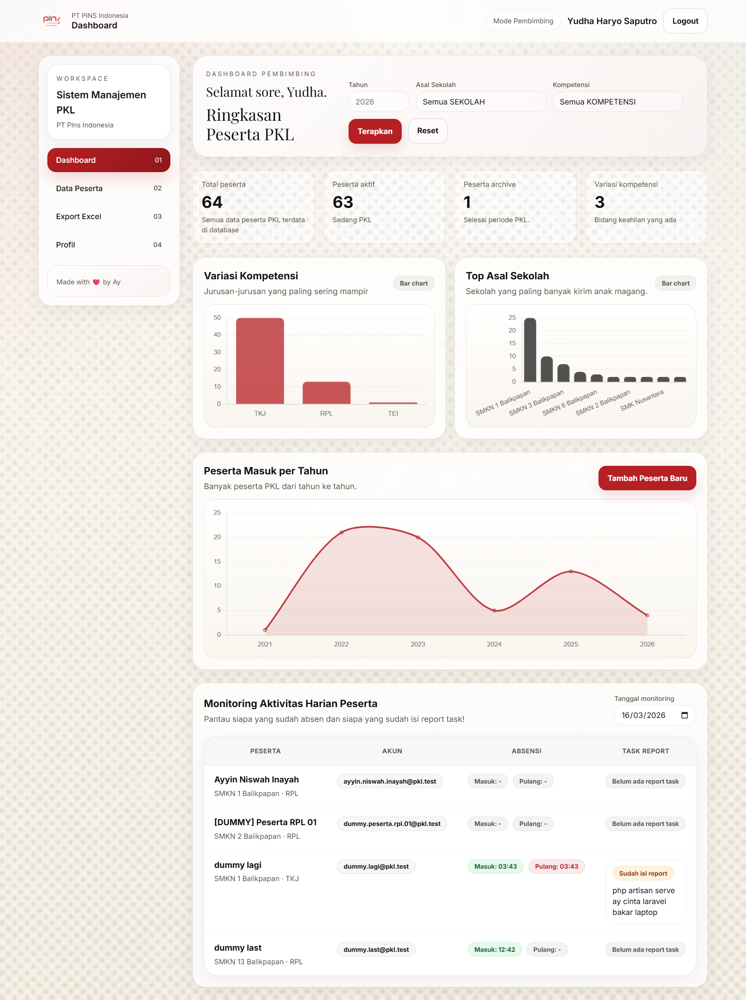
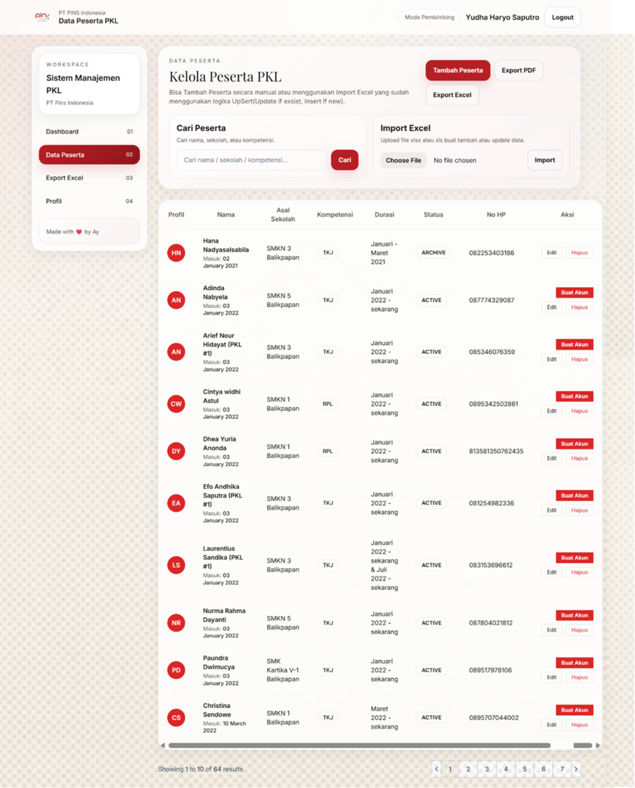

# PKL Management System (Back-Office)

Web back-office untuk mengelola data peserta PKL, laporan, dan administrasi.  
Dibuat menggunakan Laravel selama kegiatan Praktik Kerja Lapangan (PKL).

## Fitur
- Login / autentikasi
- CRUD data peserta PKL
- Dashboard
- Manajemen laporan
- Export data ke Excel dan PDF

## Teknologi
- Laravel 12
- PHP 8.2
- MySQL
- Composer
- Git

## Screenshot

Login Page  


Dashboard  


Data Peserta  


## Cara Menjalankan

```bash
git clone https://github.com/ayamcademic/system-pkl-pins.git
cd pkl-management-system-laravel
composer install
cp .env.example .env
php artisan key:generate
php artisan migrate
php artisan serve
